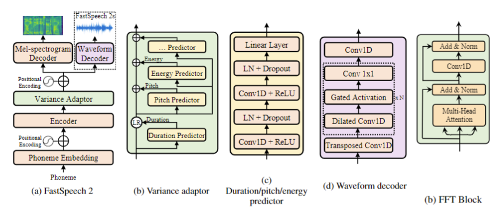

## The architecture of FastSpeech 2

1. Encoder and Mel-spectrogram decoder architecture - see Transformer and FastSpeech paper 
2. Variance adaptor architecture - see FastSpeech 2 paper
3. PostNet architecture - see Tacotron 2 paper
